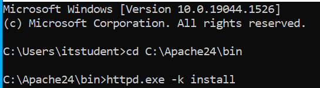

# WebServerProject1

## To install Apache and create two sites we first have to go to the website.
 First, ensure that you have the latest C++ redistributable from visual studio and download this, choosing the 64 bit.
 Once this is downloaded, run and agree to the terms then install. After the set says succesful we move to the next step.
1. Go [Here] (https://www.apachelounge.com/download/#google_vignette) to download Apache 2.4.52 Win64.
2. Download the zip folder called  httpd-2.4.52-win64-VS16.zip and extract all.   
3. Copy folder called Apache24 onto your C: Drive. 
4. Open a Command prompt with admin privileges and cd into the Apache24 folder and go into bin by typing cd C:\Apache24\bin.
5. Then install the apache service by typing httpd.exe -k install.

7. It will ask you for windows firewall access, click allow access.
8. To start it type in your terminal httpd.exe -k start.
9. After doing this, you can test your browser to see if it works. 
10. Go to localhost in your web browser and you should see a message saying, " It works!".

12. You can also shut down apache by pressing Cntrl+C.

## How to disable directory listing
1. Open notepad, right click and run ad administrator. 
2. go to C:\Apache24\conf\httpd.conf and opwn this file.
- Scroll down Mid-way of the file, you will see Options **Indexes FollowSymLinks**
- Change this to **Indexes FollowSymLinks** and save and close. 

## How to add two sites 
1. To add 2 sites go to C:\Apache24\htdocs.
2. There you will see an index.html file which comes with htdocs.
3. Create two folders called site1.tbd and site2.tbd and add an index.html inside them both were you add your html/css information for your site.
- Site 1 

- Site 2

5. To be able to implement and host multiple sites we would have to go to C:\Apache24\conf into our httpd.conf file.
- When there do a ctrl-f search for **#Include conf/extra/httpd-vhosts.conf**
- Once there you remove the # that is before **Include** this uncomments this line by moving the comment marker.
-Ctrl-s to save this. 

5. Go to C:\Apache24\conf\extra and open the httpd-vhosts.conf file and there you will see virtual host information and port information.
6. Enter the following for site 1 and site 2.
- Each of our individual sites that we want to publish is referred to as a virtual host.

- Lastly, to resolve a name to an ip address go to C:\Windows\System32\drivers\etc.
- Click show all files to see your hosts file.
- Enter the ip address and site1.tbd
- Followed by the ip address and site2.tbd. 

- By doing this our client is able to resolve site1.tbd and site2.tbd to the ip of the local server.
